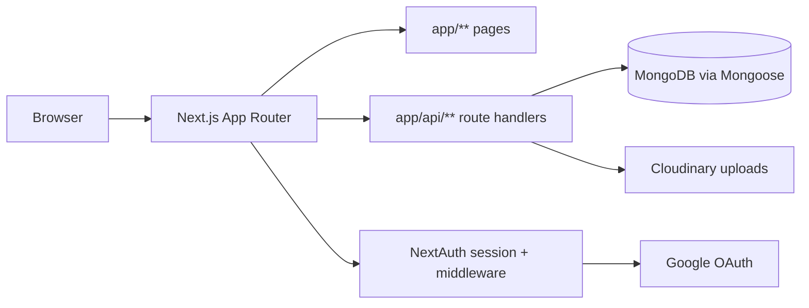

# HomeHaven — Project Overview

Internal reference for the codebase: what the app does, how it is laid out, and where things live.

---

## What This App Does

HomeHaven is a rental marketplace web app.

- Public users can browse all listings, search by location and type, and view listing details.
- Signed-in users can add, edit, and delete their own listings.
- Signed-in users can bookmark listings, view saved listings, send messages to listing owners, and view received messages.

---

## Core Product Flows

### 1) Browse and search

- Browse all properties at `app/properties/page.jsx`.
- Search runs through `app/api/properties/search/route.js`.
- Property details load at `app/properties/[id]/page.jsx`.

### 2) Listing management (authenticated)

- Add listing page: `app/properties/add/page.jsx` + `components/PropertyAddForm.jsx`.
- Edit listing page: `app/properties/[id]/edit/page.jsx` + `components/PropertyEditForm.jsx`.
- Create endpoint: `POST /api/properties` in `app/api/properties/route.js`.
- Update and delete endpoint: `PUT/DELETE /api/properties/[id]` in `app/api/properties/[id]/route.js`.

### 3) User profile and saved listings

- Profile page: `app/profile/page.jsx`.
- User listings API: `GET /api/properties/user/[userId]`.
- Saved/bookmarks: `app/properties/saved/page.jsx`, plus `app/api/bookmarks/route.js` and `app/api/bookmarks/check/route.js`.

### 4) Messaging

- Send message UI: `components/PropertyContactForm.jsx`.
- Inbox page: `app/messages/page.jsx`.
- Message APIs: `app/api/messages/route.js` and `app/api/messages/[id]/route.js`.

---

## Architecture Overview

- Framework: Next.js App Router monolith.
- Rendering: mix of server and client components.
- Backend: Route Handlers under `app/api/**` (no separate backend service).
- Database: MongoDB through Mongoose models.
- Auth: NextAuth with Google provider.
- Media: Cloudinary for image uploads.



---

## Current Folder Map

```text
app/
  layout.jsx, loading.jsx, not-found.jsx, page.jsx
  login/page.jsx
  profile/page.jsx
  messages/page.jsx
  properties/
    page.jsx
    add/page.jsx
    saved/page.jsx
    search-results/page.jsx
    [id]/page.jsx
    [id]/edit/page.jsx
  api/
    auth/[...nextauth]/route.js
    properties/route.js
    properties/[id]/route.js
    properties/search/route.js
    properties/user/[userId]/route.js
    bookmarks/route.js
    bookmarks/check/route.js
    messages/route.js
    messages/[id]/route.js
components/
config/
models/
utils/
middleware.js
__tests__/api/
```

---

## Data Model

Mongoose models are defined in:

- `models/User.js`
- `models/Property.js`
- `models/Message.js`

### User

- `email` (required, unique)
- `username` (required, unique)
- `image`
- `bookmarks` (array of `Property` ObjectIds)

### Property

- Ownership: `owner` (User ObjectId)
- Core fields: `name`, `type`, `description`
- Location: `street`, `city`, `state`, `zipcode`
- Listing details: `beds`, `baths`, `square_feet`, `amenities`, `rates`
- Contact: `seller_info`
- Images: array of uploaded image URLs
- Flags: `is_featured`

### Message

- `sender`, `recipient` (User ObjectIds)
- `property` (Property ObjectId)
- `name`, `email`, `phone`, `body`
- `read`

---

## Authentication and Authorization

- Provider: Google OAuth through NextAuth (`utils/authOptions.js`).
- Session helper: `utils/getSessionUser.js`.
- Middleware protection (`middleware.js`) currently matches:
  - `/properties/add`
  - `/properties/saved`
  - `/profile`
  - `/messages`

Authorization is also enforced in route handlers for protected mutations (for example property update/delete owner checks).

---

## Environment Variables

Environment variables used in code:

- `MONGO_URI`
- `NEXTAUTH_SECRET`
- `GOOGLE_CLIENT_ID`
- `GOOGLE_CLIENT_SECRET`
- `NEXT_AUTH_URL_INTERNAL`
- `NEXT_AUTH_URL`
- `CLOUDINARY_CLOUD_NAME`
- `CLOUDINARY_API_KEY`
- `CLOUDINARY_API_SECRET`
- `NEXT_PUBLIC_API_DOMAIN`
- `NEXT_PUBLIC_DOMAIN`

See `README.md` for purpose mapping and deployment notes.

---

## Frontend and API Patterns

- UI components live in `components/**`.
- Data fetching utilities are centralized in `utils/requests.js`.
- Some pages/components fetch directly from `/api/...`.
- Add property uses HTML form submit with `multipart/form-data`.
- Edit property uses client-side `fetch` with `FormData`.
- User-facing feedback commonly uses toasts.

---

## Testing and CI

- Test runner: Jest (`jest.config.js`).
- Existing API tests in `__tests__/api/`.
- CI pipeline in `.github/workflows/ci.yml` runs lint and tests on push/PR.

---

## Implementation Notes

- `GET /api/properties/user/[userId]` does not enforce session-based authorization — the caller is not verified against the requested user ID.
- API response shape and `Content-Type` headers are not uniform across handlers.
- Input validation relies on Mongoose schema constraints plus ad-hoc checks; no shared validation layer.
- Auth/session and error paths in message and bookmark routes still need hardening.
